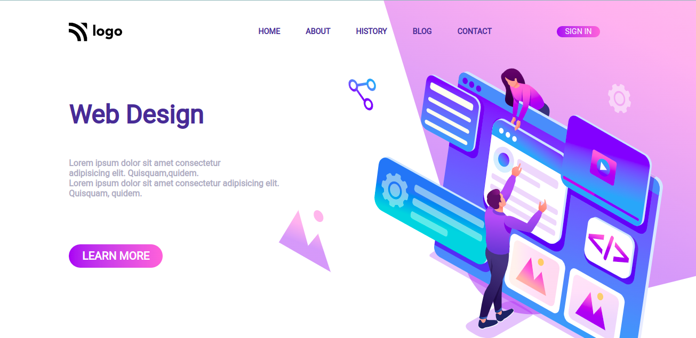
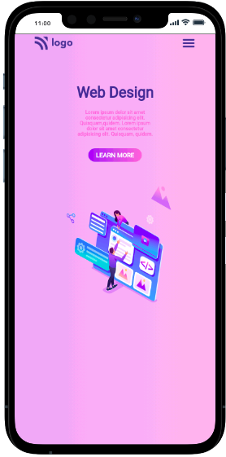

# Project-8: Design Landing page

- This project is a Design landing page.This website is designed using pure HTML and CSS.I have made this site fully responsive.

- It took me 3-4hr to make this project.Please find link og project below:

---

## Breakpoints

- I have takent **Three** breakpoints to make this site responsive.

  - First at **1024px** for small screen laptops.
  - Second at **768px** for tablets.
  - Third at **480px** for mobiles.

## Screenshot

---

## 🛠 Skills learned

HTML, CSS, Make responsive site.

---

## 🚀 About Me

### Hey, I am Yasir lambawala

- I am born and brought up in Vadodara, Gujarat. I have done my Btech at GTU university and I am currently learning Web-development.

---

## Feedback

- If you have any feedback, please reach me at lambawalay@gmail.com
